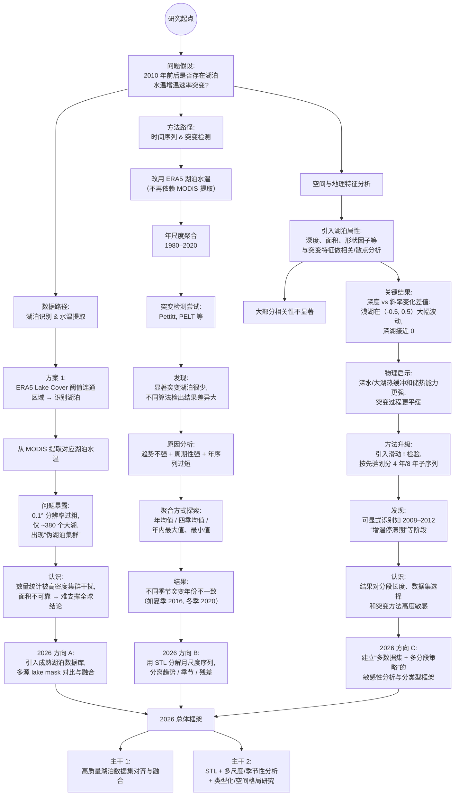

# 01 / 22 / 2026

---
layout: center
---

```mermaid
flowchart TD
  %% 起点与核心问题
  START((研究起点))
  START --> Q1[问题假设:\n2010 年前后是否存在湖泊水温增温速率突变?]

  %% 分成三条并行主线
  Q1 --> D_PATH[数据路径:\n湖泊识别 & 水温提取]
  Q1 --> M_PATH[方法路径:\n时间序列 & 突变检测]
  Q1 --> S_PATH[空间与地理特征分析]

  %% 数据路径：ERA5 Lake Cover + MODIS
  D_PATH --> D1[方案 1:\nERA5 Lake Cover 阈值连通区域 → 识别湖泊]
  D1 --> D2[从 MODIS 提取对应湖泊水温]
  D2 --> D_PROB[问题暴露:\n0.1° 分辨率过粗,\n仅 ~380 个大湖,\n出现“伪湖泊集群”]
  D_PROB --> D_LEARN[认识:\n数量统计被高密度集群干扰,\n面积不可靠 → 难支撑全球结论]
  D_LEARN --> D2026[2026 方向 A:\n引入成熟湖泊数据库,\n多源 lake mask 对比与融合]

  %% 方法路径：直接用 ERA5 水温 + 突变检测
  M_PATH --> M1[改用 ERA5 湖泊水温\n（不再依赖 MODIS 提取）]
  M1 --> M2[年尺度聚合\n1980–2020]
  M2 --> M3[突变检测尝试:\nPettitt, PELT 等]
  M3 --> M_PROB[发现:\n显著突变湖泊很少,\n不同算法检出结果差异大]
  M_PROB --> M_CAUSE[原因分析:\n趋势不强 + 周期性强 + 年序列过短]
  M_CAUSE --> M_AGG[聚合方式探索:\n年均值 / 四季均值 /\n年内最大值、最小值]
  M_AGG --> M_SEASON[结果:\n不同季节突变年份不一致\n（如夏季 2016, 冬季 2020）]
  M_SEASON --> M2026[2026 方向 B:\n用 STL 分解月尺度序列,\n分离趋势 / 季节 / 残差]

  %% 空间 & 地理特征路径
  S_PATH --> S1[引入湖泊属性:\n深度、面积、形状因子等\n与突变特征做相关/散点分析]
  S1 --> S_RES1[大部分相关性不显著]
  S1 --> S_RES2[关键结果:\n深度 vs 斜率变化差值:\n浅湖在（-0.5, 0.5）大幅波动,\n深湖接近 0]
  S_RES2 --> S_PHYS[物理启示:\n深水/大湖热缓冲和储热能力更强,\n突变过程更平缓]
  S_PHYS --> T1[方法升级:\n引入滑动 t 检验,\n按先验划分 4 年/8 年子序列]
  T1 --> T2[发现:\n可显式识别如 2008–2012\n“增温停滞期”等阶段]
  T2 --> T_PROB[认识:\n结果对分段长度、数据集选择\n和突变方法高度敏感]
  T_PROB --> S2026[2026 方向 C:\n建立“多数据集 + 多分段策略”的\n敏感性分析与分类型框架]

  %% 汇合到 2026 总体规划
  D2026 --> PLAN2026[2026 总体框架]
  M2026 --> PLAN2026
  S2026 --> PLAN2026

  PLAN2026 --> PLAN_DATA[主干 1:\n高质量湖泊数据集对齐与融合]
  PLAN2026 --> PLAN_METHOD[主干 2:\nSTL + 多尺度/季节性分析\n+ 类型化/空间格局研究]
```
